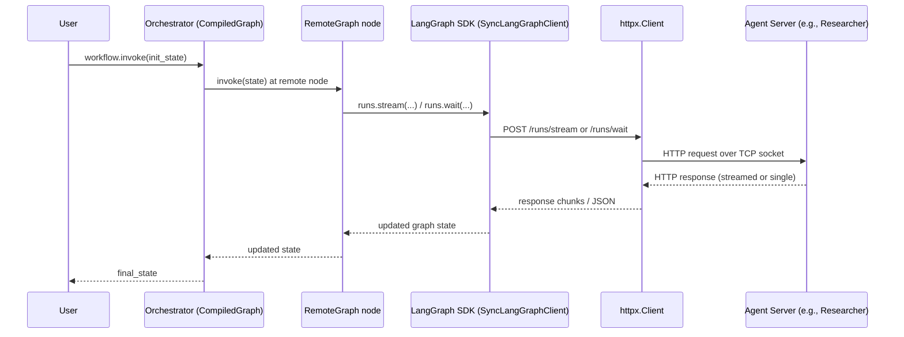

# Network.md

This document explains how networking works in this repository’s LangGraph-based multi‑agent system:

1. What actually happens when you call `final_state = workflow.invoke(init_state)`.
2. Who creates the TCP socket and which HTTP stack is used (where `requests` is used vs where it is **not**).
3. How to run the "server" side (agents) so they expose the correct APIs to the orchestrator.
4. How the LangGraph SDK creates socket connections at a lower level, and where you can monkey‑patch it to use your own SDK/transport.

---

## 1. Orchestrator side: what happens on `workflow.invoke(init_state)`

### 1.1 High‑level data flow

At the top level, your orchestrator does:

```python
from graph.capability_discovery import discover_capabilities
from graph.build_graph import build_graph
from models.state import AgentState
from langchain_core.messages import HumanMessage

capability_index = discover_capabilities()
workflow = build_graph(capability_index=capability_index)

init_state: AgentState = {
    "messages": [HumanMessage(content=q)],
    "next": "Supervisor",
    "context": {"capabilities": sorted(capability_index.keys())},
}

final_state = workflow.invoke(init_state)
```

`build_graph` wires in **remote nodes** via `RemoteGraph`:

```python
from langgraph.graph import StateGraph, END
from langgraph.pregel.remote import RemoteGraph

researcher_remote = RemoteGraph("researcher", url=researcher_service_url)
document_creator_remote = RemoteGraph("document_creator", url=document_creator_service_url)
gmail_remote = RemoteGraph("gmail", url=gmail_service_url)
supervisor_remote = RemoteGraph("supervisor", url=supervisor_service_url)
```

Conceptually, the call flow for a single step looks like this:



### 1.2 Who actually creates the socket?

There are two separate HTTP call sites in this repo:

1. **Capability discovery** (`graph/capability_discovery.py`)
   * Uses **`requests`** directly to call each agent’s `/graphs` endpoint.
   * Example:
     ```python
     import requests

     response = requests.get(f"{base_url}/graphs", timeout=timeout)
     ```
   * This is only used at startup to build `capability_index`.

2. **Remote node execution** (during `workflow.invoke`)
   * Uses **LangGraph’s own SDK + `httpx`**, *not* your `requests` imports.
   * `RemoteGraph` talks to a `LangGraphClient` / `SyncLangGraphClient` from `langgraph_sdk`.
   * Those clients internally own an HTTP layer (`HttpClient` / `SyncHttpClient`), which wraps **`httpx.AsyncClient` / `httpx.Client`**.
   * `httpx` then uses **httpcore** and Python’s built‑in `socket` module to open the TCP connection.

So the socket stack for remote execution is:

> `workflow.invoke` → LangGraph engine → `RemoteGraph` → `SyncLangGraphClient` → `SyncHttpClient` → `httpx.Client` → `httpcore` → `socket`

The only place `requests` is involved is during `/graphs` capability discovery.

### 1.3 Endpoints used

* **Discovery:** `GET {agent_url}/graphs` via `requests` (your code).
* **Remote execution (Agent Server API):**
  * `POST {agent_url}/runs/stream` – streaming run output.
  * `POST {agent_url}/runs/wait` – run and wait for final result.
  * `POST {agent_url}/threads/{thread_id}/runs/stream` – same but with thread state.

LangGraph SDK’s `.runs.stream(...)` / `.runs.wait(...)` wrap these endpoints.

---

## 2. Agent/server side: how to expose APIs to the orchestrator

There are two ways agents can run in this repo:

1. As **LangGraph Agent Servers** (what `RemoteGraph` expects).
2. As **FastAPI + LangServe** services (used by tests and manual calls).

### 2.1 LangGraph Agent Server (for orchestrator / RemoteGraph)

Each agent directory has a `langgraph.json` that maps a graph ID to a `build_*_graph` function, e.g.:

```json
{
  "dependencies": ["."],
  "graphs": {
    "researcher": "graph:build_researcher_graph"
  }
}
```

To run these as Agent Servers locally:

```bash
# Supervisor
cd agents/supervisor
langgraph dev --port 8004

# Researcher
cd agents/researcher
langgraph dev --port 8001

# Document Creator
cd agents/document_creator
langgraph dev --port 8002

# Gmail
cd agents/gmail
langgraph dev --port 8000

# Direct Answer (optional)
cd agents/direct_answer
langgraph dev --port 8003
```

Then configure environment in the repo root (e.g. `.env`):

```bash
AGENT_SERVICES=http://localhost:8001,http://localhost:8002,http://localhost:8000,http://localhost:8004

RESEARCHER_SERVICE_URL=http://localhost:8001
DOCUMENT_CREATOR_SERVICE_URL=http://localhost:8002
GMAIL_SERVICE_URL=http://localhost:8000
SUPERVISOR_SERVICE_URL=http://localhost:8004
```

With this setup:

1. `discover_capabilities()` calls `GET /graphs` on each Agent Server via `requests`.
2. `RemoteGraph("researcher", url="http://localhost:8001")` calls `POST /runs/stream` or `/runs/wait` via `langgraph_sdk` + `httpx`.

Network view:

```mermaid
flowchart LR
    subgraph Orchestrator
        A[CompiledGraph
        (workflow.invoke)] --> B[RemoteGraph node]
    end

    B -->|HTTP (LangGraph SDK)| S1[Researcher Agent Server
    (langgraph dev --port 8001)]
    B -->|HTTP| S2[DocumentCreator Agent Server
    (port 8002)]
    B -->|HTTP| S3[Gmail Agent Server
    (port 8000)]
    B -->|HTTP| S4[Supervisor Agent Server
    (port 8004)]

    S1:::server
    S2:::server
    S3:::server
    S4:::server

    classDef server fill:#eef,stroke:#88a;
```

### 2.2 FastAPI + LangServe services (alternate API)

Each agent also ships a FastAPI service (used in your `tests/system` and for direct HTTP usage):

Examples:

```bash
# Researcher FastAPI
python agents/researcher/run_service.py
# or
uvicorn agents.researcher.service:app --host 0.0.0.0 --port 8001 --reload

# Document Creator
python agents/document_creator/run_service.py
# or
uvicorn agents.document_creator.service:app --host 0.0.0.0 --port 8002 --reload

# Gmail
python agents/gmail/run_service.py
# or
uvicorn agents.gmail.service:app --host 0.0.0.0 --port 8000 --reload

# Direct Answer
python agents/direct_answer/run_service.py
# or
uvicorn agents.direct_answer.service:app --host 0.0.0.0 --port 8003 --reload
```

These expose:

* `GET /` – health and metadata.
* LangServe chain endpoints: `POST /agent/invoke`, `POST /agent/stream`.
* LangGraph graph endpoints: `POST /graph/invoke`, `POST /graph/stream`.
* `POST /chat` – convenience chat endpoint.

Your **system tests** talk to `/agent/invoke`, not `/runs/stream`. For orchestrator/RemoteGraph + capability discovery, the relevant servers are the `langgraph dev` ones (Agent Servers), not the FastAPI services.

---

## 3. How the LangGraph SDK creates socket connections

This section focuses on the **client networking path** you want to monkey‑patch.

### 3.1 Key classes in the stack

From top to bottom:

1. **`RemoteGraph`** (`langgraph.pregel.remote.RemoteGraph`)
   * Represents a remote graph (e.g., your Researcher agent) as a node inside a compiled local graph.
   * Exposes `.invoke()`, `.stream()`, etc., mirroring the `CompiledGraph` API.
   * Internally uses either a `LangGraphClient` or `SyncLangGraphClient`.

2. **`LangGraphClient` / `SyncLangGraphClient`** (in `langgraph_sdk`)
   * High‑level SDK clients that expose `.runs.stream`, `.runs.wait`, `.threads.create`, etc.
   * Own an HTTP layer:
     * `LangGraphClient` → `HttpClient` (async).
     * `SyncLangGraphClient` → `SyncHttpClient` (sync).

3. **`HttpClient` / `SyncHttpClient`**
   * Middle layer that provides `.get`, `.post`, `.stream`, etc.
   * Wraps concrete HTTP implementations:
     * `HttpClient.client` is an `httpx.AsyncClient`.
     * `SyncHttpClient.client` is an `httpx.Client`.
   * For streaming (`runs.stream`), they use Server‑Sent Events (SSE) over a long‑lived HTTP response.

4. **`httpx.AsyncClient` / `httpx.Client`**
   * Modern HTTP client built on **httpcore**.
   * Responsible for creating TCP connections (or ASGI transports) and doing the actual socket IO.

5. **`httpcore` + `socket`**
   * `httpcore` implements connection pooling, timeouts, etc.
   * Uses Python’s standard library `socket` to open TCP sockets.

Call‑stack view:

```mermaid
graph TD
    A[CompiledGraph
    workflow.invoke] --> B[RemoteGraph node]
    B --> C[SyncLangGraphClient
    (runs.stream / runs.wait)]
    C --> D[SyncHttpClient]
    D --> E[httpx.Client]
    E --> F[httpcore]
    F --> G[socket]

    classDef sdk fill:#eef,stroke:#66a;
    class B,C,D,E,F sdk;
```

### 3.2 Conceptual `SyncHttpClient` implementation

The exact SDK implementation may evolve, but conceptually it looks like this:

```python
import httpx

class SyncHttpClient:
    def __init__(self, base_url: str, headers: dict | None = None, timeout: float | None = None):
        self.client = httpx.Client(
            base_url=base_url,
            headers=headers,
            timeout=timeout,
        )

    def get(self, path: str, **kwargs):
        return self.client.get(path, **kwargs)

    def post(self, path: str, **kwargs):
        return self.client.post(path, **kwargs)

    def stream(self, method: str, path: str, **kwargs):
        """HTTP streaming, used for SSE (Server‑Sent Events)."""
        with self.client.stream(method, path, **kwargs) as resp:
            resp.raise_for_status()
            # Parse SSE from resp.iter_text() and yield events
            for event in parse_sse(resp):
                yield event
```

`LangGraphClient` and `SyncLangGraphClient` then build higher‑level methods like `.runs.stream` on top of this.

### 3.3 SSE (streaming) vs non‑streaming

* **Streaming runs** (e.g., live token streaming, events):
  * SDK calls `SyncHttpClient.stream("POST", "/runs/stream", json=payload, ...)`.
  * Underneath, `httpx.Client.stream` keeps the TCP socket open and yields SSE events.

* **Non‑streaming runs** (wait for final result):
  * SDK calls `SyncHttpClient.post("/runs/wait", json=payload, ...)`.
  * `httpx.Client.post` opens a connection, sends the request, reads the response, and closes or returns it to the pool.

### 3.4 In‑process optimization (ASGI transport)

The SDK also supports an optimization where, when you call `get_client(url=None)` **inside a LangGraph server process**, it may configure an **ASGI transport** instead of raw TCP:

* In that case, `httpx.AsyncClient` can use an in‑process ASGI app instead of opening a real socket.
* For your orchestrator calling external agents by URL, you are on the **real TCP path** (explicit `url=...` passed to `RemoteGraph`).

This matters when monkey‑patching: patches that assume TCP should be careful not to break the ASGI case, if you ever use it.

---

## 4. Monkey‑patching to override LangGraph’s socket opening

Your goal: **“override the LangGraph socket opening, and use my own SDK to make the actual connection.”**

There are three natural places to hook in, from highest to lowest level.

### 4.1 Patch the SDK HTTP layer (`HttpClient` / `SyncHttpClient`) – recommended

This is the cleanest seam: all LangGraph network IO flows through `HttpClient` (async) and `SyncHttpClient` (sync). You can:

1. Subclass or wrap `SyncHttpClient`.
2. Replace its `self.client` (the `httpx.Client`) with your own transport.
3. Monkey‑patch the class in `langgraph_sdk` so anything that constructs it uses your version.

Example sketch:

```python
import langgraph_sdk.client as lgc

RealSyncHttpClient = lgc.SyncHttpClient

class MyTransportClient:
    """Example adapter over your own SDK.

    It should mimic the subset of httpx.Client that SyncHttpClient expects:
    - .get/.post/.put/.patch/.delete
    - .stream (for SSE)
    - return objects with .status_code, .json(), .text, .headers
    """

    def __init__(self, base_url: str, headers: dict | None = None, timeout: float | None = None):
        self.base_url = base_url
        self.headers = headers or {}
        self.timeout = timeout
        # TODO: initialize your own SDK client here

    def post(self, path: str, **kwargs):
        # Use your SDK instead of httpx
        # Build full URL, send request, wrap response in a httpx-like object
        return self._request("POST", path, **kwargs)

    def stream(self, method: str, path: str, **kwargs):
        # Use your SDK’s streaming API and yield SSE-like chunks
        for event in self._stream_request(method, path, **kwargs):
            yield event

    # Implement other verbs and helpers as needed...


class MySyncHttpClient(RealSyncHttpClient):
    def __init__(self, *args, **kwargs):
        # Let the real ctor run first, so we can read base_url/headers if needed
        super().__init__(*args, **kwargs)

        # Replace the underlying httpx.Client with our custom transport
        base_url = str(self.client.base_url)
        headers = dict(self.client.headers)
        timeout = self.client.timeout

        self.client = MyTransportClient(base_url=base_url, headers=headers, timeout=timeout)


# Monkey‑patch: all future SyncHttpClient constructions use our subclass
lgc.SyncHttpClient = MySyncHttpClient
```

With this patch in place (applied **before** you build graphs or call `workflow.invoke`), all `RemoteGraph` calls that go through `SyncLangGraphClient` will end up using `MyTransportClient` instead of `httpx.Client`.

You can apply a similar pattern to `HttpClient` (async) if you need to support `RemoteGraph.ainvoke` / `astream`.

### 4.2 Patch client factories (`get_client` / `get_sync_client`)

`RemoteGraph` typically creates its client via these helpers when you only provide a URL:

```python
from langgraph_sdk import get_client, get_sync_client

client = get_client(url="http://localhost:2024")
sync_client = get_sync_client(url="http://localhost:2024")
```

You can override these functions to construct clients that use your own HTTP layer:

```python
import langgraph_sdk.client as lgc

_orig_get_sync_client = lgc.get_sync_client


def my_get_sync_client(*, url=None, api_key=lgc.NOT_PROVIDED, headers=None, timeout=None):
    # Create a SyncHttpClient that already uses your custom transport
    http_client = MySyncHttpClient(base_url=url, headers=headers, timeout=timeout)
    return lgc.SyncLangGraphClient(http_client=http_client)


lgc.get_sync_client = my_get_sync_client
```

Any `RemoteGraph(..., url=...)` that doesn’t pass a custom client will now use your patched factory and, by extension, your transport.

### 4.3 Patch `httpx` directly (global hook)

As a last resort, you can patch `httpx` itself, for example:

* Override `httpx.Client.__init__` to inject a custom `transport=...`.
* Wrap `httpx.Client.send` / `.stream` to delegate to your own SDK.

This works, but it affects **all** usage of `httpx` in the process (including unrelated libraries), so it’s much harder to reason about and test.

---

## 5. Putting it all together

Combined view of where your monkey‑patch will sit:

```mermaid
flowchart TD
    subgraph Local Process
        A[CompiledGraph<br/>workflow.invoke] --> B[RemoteGraph]
        B --> C[SyncLangGraphClient]
        C --> D[SyncHttpClient<br/>(monkey‑patched)]
        D --> E[MyTransportClient<br/>(your SDK)]
    end

    E -->|HTTP or custom protocol| F[Agent Server<br/>(/runs/stream, /runs/wait)]
```

Key points:

1. **Discovery path** (`discover_capabilities`) is separate and still uses `requests` for `/graphs`.
2. **Execution path** (`workflow.invoke`) uses `RemoteGraph` → SDK → `httpx` by default.
3. You can cleanly intercept that execution path by patching `SyncHttpClient` / `HttpClient` (preferred) or by overriding `get_client` / `get_sync_client`.
4. As long as your custom transport returns response/stream objects that look like the originals, the rest of LangGraph (RemoteGraph, graph engine, Supervisor, etc.) will keep working unchanged.

This file should give any future maintainer enough detail to:

* Understand which parts of the stack open sockets and how.
* Run the agent servers correctly for both development and orchestration.
* Safely inject a custom networking layer in front of LangGraph’s HTTP stack using monkey‑patching.